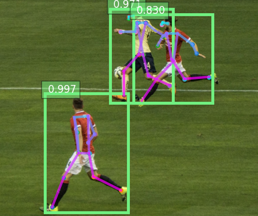

<h1>Pose Estimation using AlphaPose in Python at IMSAR</h1>
 
<h2>Features</h2>
<ul>
    <li>Coco Dataset: val 2017</li>
    <li>AlphaPose using gluoncv</li>
    <li> detector & posenet</li>
    <li>Live camera feed human decttection in boxes</li>
</ul>

<h2>Acknowledgments</h2>

<b> Python3: http://bit.ly/python3-certifications </b>
 
<b> Machine Learning: https://bit.ly/machine-learning-certification <b>
 

<h2>Photo</h2>

 

<b> Email: mariusc0023@gmail.com </b>
